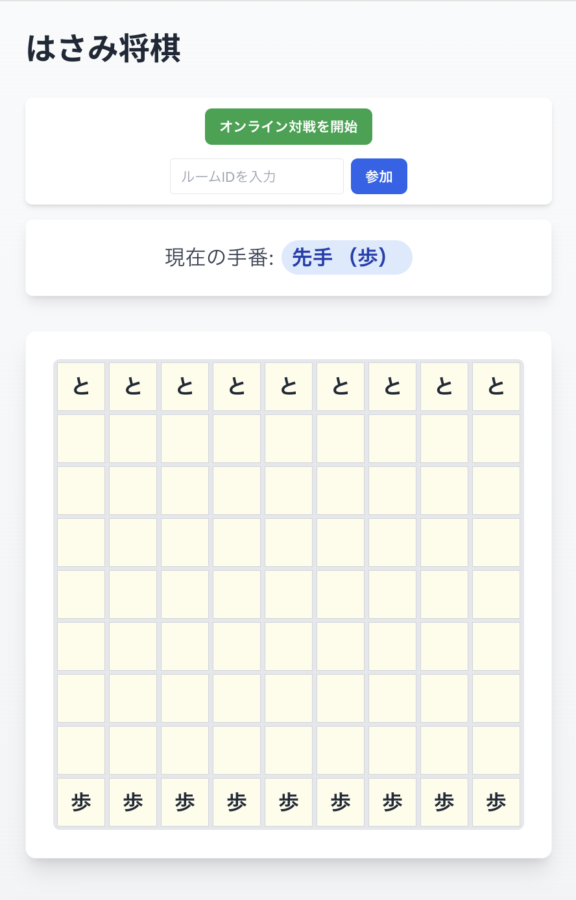

# はさみ将棋
React + TypeScript + Tailwind CSS で作られたはさみ将棋アプリケーションです。

[https://hasami-shogi.dev](https://hasami-shogi.dev)

## 機能

### 1. 通常対戦
- 同じデバイスで2人が交互に操作して遊ぶことができます
- 先手（歩）と後手（と）が交互に手を指します
- 勝敗が決まったら「もう一度プレイ」で再開できます

### 2. オンライン対戦
- 離れた場所にいる相手とリアルタイムで対戦できます
- ルームを作成して相手を招待することができます
- 相手のルームIDを入力して参加することができます
- 対戦中は相手の手を自動的に同期して表示します

## ゲームのルール

はさみ将棋は、9×9のマス目で遊ぶ2人用のボードゲームです。

### 基本ルール

1. **初期配置**
   - 先手（歩）：最下段に9個の駒を配置
   - 後手（と）：最上段に9個の駒を配置

2. **駒の動き**
   - 駒は縦・横の直線方向にのみ移動可能
   - 他の駒を飛び越えることはできない
   - 1回の手番で1つの駒のみ動かせる

3. **駒の取り方（はさみ）**
   - 自分の駒2つで相手の駒を縦または横方向ではさむと、はさまれた駒を取ることができる
   - 複数の駒を同時にはさむことも可能
   - はさみは移動後に判定される

4. **勝利条件**
   以下のいずれかの条件を満たすと勝利：
   - 相手の駒をすべて取る
   - 相手の駒が動けない状態にする

### 特記事項

- 斜め方向の移動ははさみの判定も含めて不可
- 駒を取ることは任意ではなく、はさんだ場合は必ず取らなければならない
- 一度の手で複数の方向のはさみが成立した場合、すべての方向の駒を取る

### ゲームの進行

1. 先手（歩）から開始
2. 交互に1手ずつ指す
3. 勝利条件を満たすまで継続

## 技術スタック

- React 18
- TypeScript 5
- Tailwind CSS
- Firebase Realtime Database
- Vite

## バージョン履歴

### 0.2.0
- オンライン対戦機能を実装
  - リアルタイムでの対戦が可能に
  - ルーム作成・参加機能
  - 対戦状態の同期
  - 勝敗判定の同期

### 0.1.0
- 基本機能を実装
  - ローカルでの2人対戦
  - 駒の移動ロジック
  - はさみ判定
  - 勝利判定
